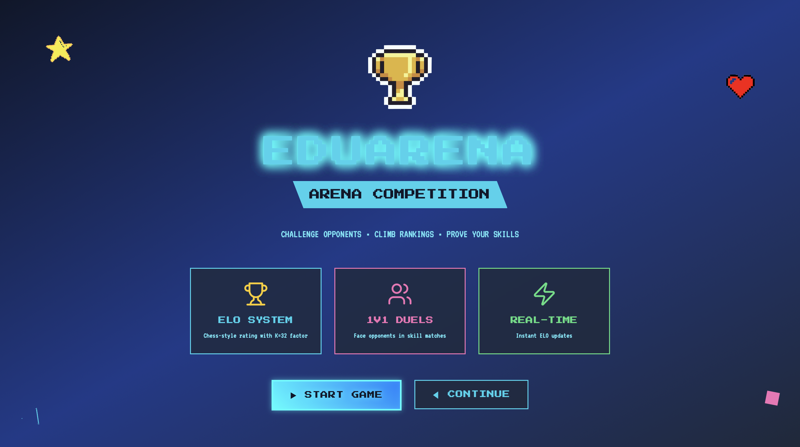
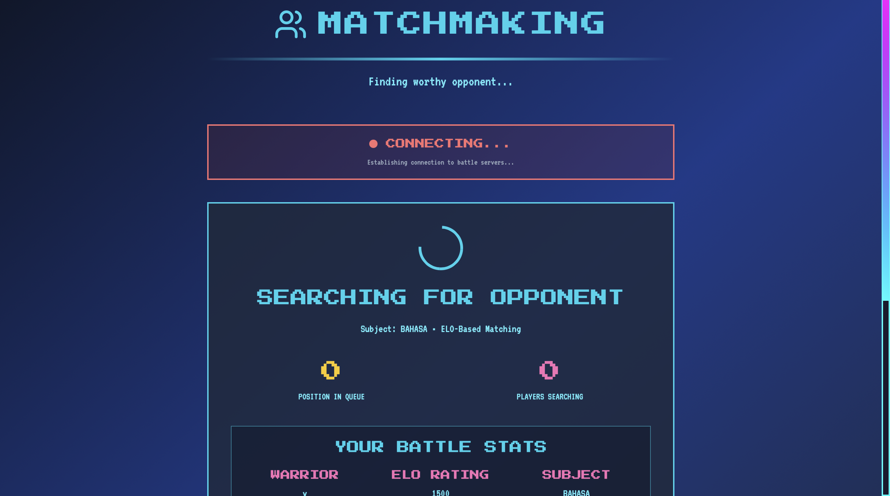
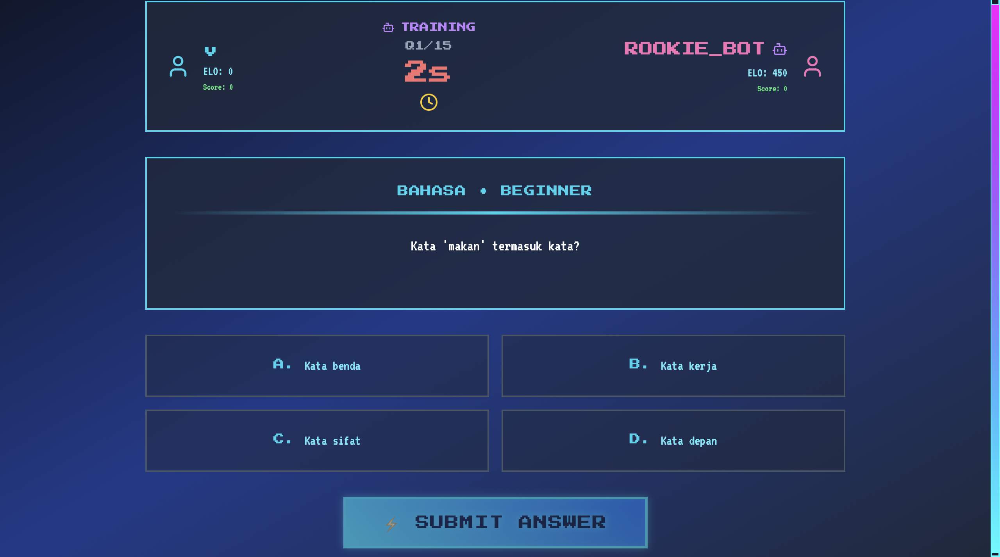
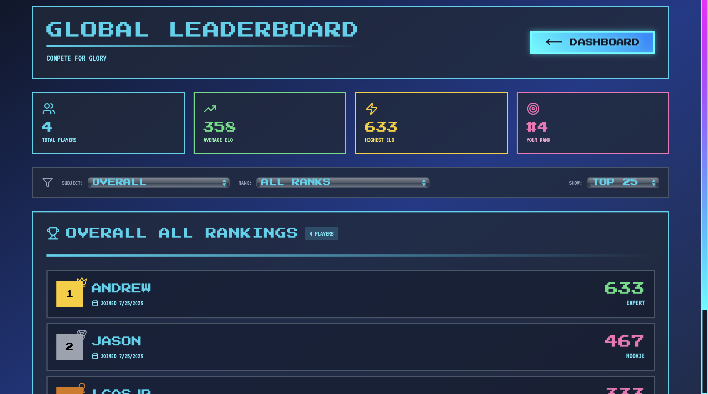
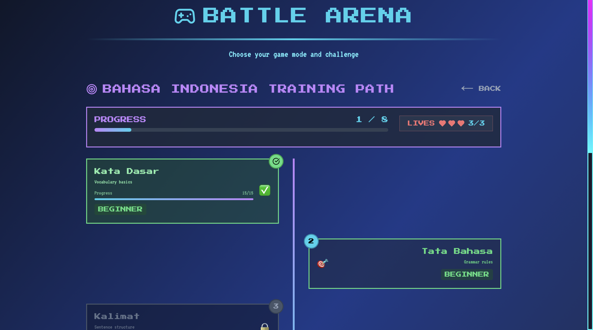
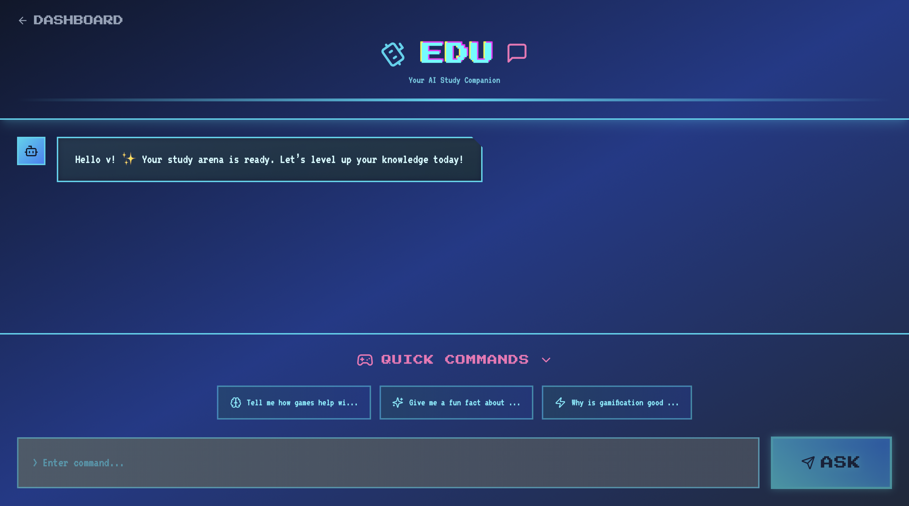
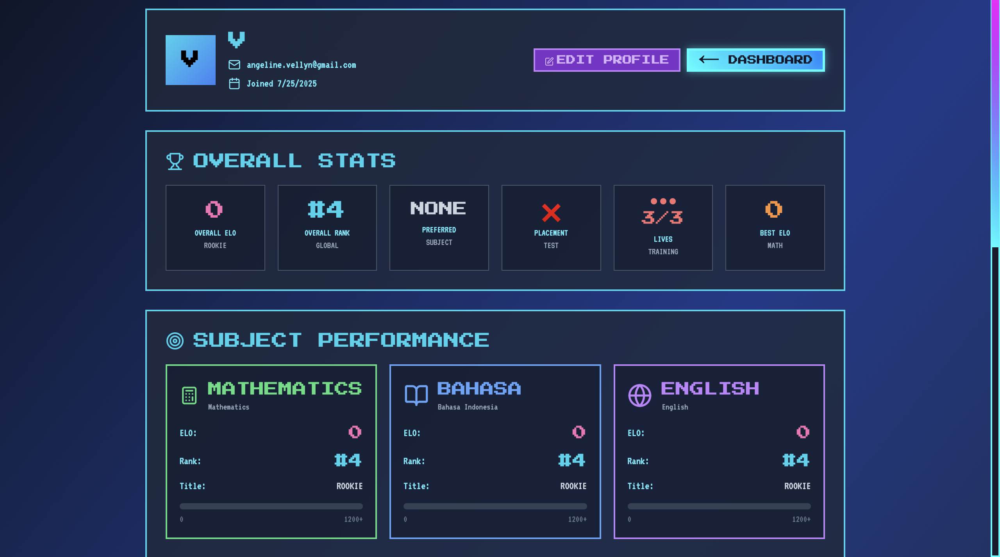

# 🎓 LCAS Jr - EDUARENA

An interactive, real-time quiz platform built with **Next.js**, featuring **Duolingo-style training**, competitive **PvP battles**, and **AI-generated questions**. Powered by **Firebase** and **Gemini AI**.

---

## Documentations


Battle Arena


1v1 Player Battle




Training with Bot


Edu: AI Study Assistant


Profile



---

## 🚀 Features

- 🎯 **Multi-Subject ELO Ranking**  
  Separate ELO for:
  - Math
  - Bahasa Indonesia
  - English

- 🧠 **AI-Powered Quiz Generation**  
  Contextual questions tailored by difficulty and subject via **Gemini AI**

- 🕹️ **PvP Ranked Battles**  
  Real-time matchmaking & ELO adjustment system

- 🟢 **Duolingo-style Training Mode**  
  15 questions per level, 3-life system, persistent progress

- 🔁 **Real-Time Game State**  
  Synced using **Firebase Firestore**

- 🧪 **Placement Test System**  
  Dynamic skill test to assign initial ELO ratings


---

### 🧪 Try AI Generation

Log in and visit:  
/debug-ai-quiz

Test various combinations of subject & difficulty.

---

### 📝 Supported Subjects

- **Math**: Arithmetic, algebra, geometry  
- **Bahasa Indonesia**: Grammar, vocabulary, reading  
- **English**: Grammar, vocabulary, comprehension  

---

## 🎮 Training Mode (3-Lives System)

- Players start with **3 lives** per level  
- Wrong answer ➝ -1 life  
- Level ends if:
  - 3 lives lost  
  - or 15 questions completed  
- Progress is saved across sessions  

---

## 🛠️ Development

```bash
npm install
npm run dev
```
### 🔐 Firebase Configuration


## 📌 Tech Stack

- **Frontend**: Next.js 14, TailwindCSS  
- **Backend**: Firebase Admin SDK  
- **Real-Time**: Firebase Firestore  
- **AI**: Gemini API by Google  
- **Auth**: Firebase Authentication  

---

## 💡 Inspiration

Combines the best of:  
- 🧩 **Duolingo’s gamified learning**  
- ♟️ **Chess.com’s ELO-based matchmaking**  
- 🤖 **AI-driven personalization**


